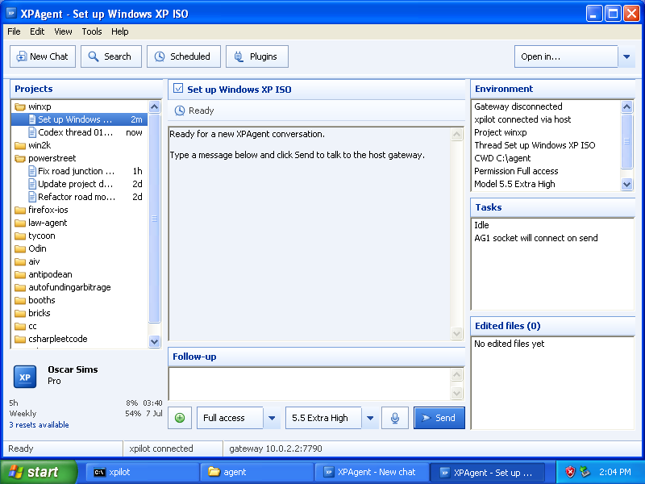

# Agentic WinXP

Experiments in getting agents running on Windows XP.



This involves two parts:
- `xpilot`, which allows Codex or your MacOS LLM agent of choice to pilot XP.
- An agent library and GUI to allow XP to call modern LLMs.

## Quickstart

Prerequisites: QEMU, Python 3, and `curl`. On macOS with Homebrew:

```sh
brew install qemu
```

By default the scripts look for:

```text
en_windows_xp_professional_with_service_pack_3_x86_cd_vl_x14-73974.iso
```

Use that filename or set `WINXP_ISO` when running the install script.

Create and install the VM:

```sh
mkdir -p vm
qemu-img create -f qcow2 vm/winxp.qcow2 16G
./scripts/install-xp.sh
```

Boot it later with:

```sh
./scripts/run-xp.sh
```

## Build The XP Payload

Download the official TinyCC archives and build the transfer zip:

```sh
./scripts/fetch-tools.sh
./scripts/package-agent-kit.sh
./scripts/serve-transfer.sh
```

From XP, open:

```text
http://10.0.2.2:8000/agent-kit.zip
```

Extract it to `C:\`, creating:

```text
C:\tcc
C:\agent
```

Then build and run the XP bridge:

```bat
cd \agent
build-xpilot.bat
xpilot.exe
```

To start it after login, copy `C:\agent\xpilot-startup.bat` to:

```text
C:\Documents and Settings\All Users\Start Menu\Programs\Startup
```

After XP logs in, the Startup-folder wrapper should launch `xpilot.exe`. Check
the bridge from macOS:

```sh
./xpilotctl.py status
./xpilotctl.py info
./xpilotctl.py shell
```

Common commands:

```sh
./xpilotctl.py run 'ver'
./xpilotctl.py ls 'C:\agent'
./xpilotctl.py cat 'C:\agent\README-XP.txt'
./xpilotctl.py put ./local.c 'C:\agent\local.c'
./xpilotctl.py get 'C:\agent\src\xpilot.c' /tmp/xpilot.c
./xpilotctl.py screenshot /tmp/xp-screen.bmp
./xpilotctl.py putdir ./guest 'C:\agent\guest-copy'
./xpilotctl.py getdir 'C:\agent' /tmp/agent-copy
```

## xpagent

Start the host gateway on macOS:

```sh
./host/agent_gateway.py --backend codex
```

The gateway shells out to `codex exec` on the host and stores the Codex thread
id in `.state/xpagent-codex-thread.txt`, so later `xpagent` runs can resume the
same conversation. Use `--codex-new-session` to start over. XP speaks only the
small `AG1` protocol and never sees API keys or modern auth.

With `--backend codex`, the gateway can also let Codex operate XP through the
existing `xpilot` bridge. Initial tools include `xp.run`, `xp.list_dir`,
`xp.read_file`, `xp.write_file`, and directory/file helpers. Disable that tool
loop with `--disable-xp-tools`.

Build and test it inside XP:

```bat
cd \agent
build-xpagent.bat
xpagent.exe
```

When testing tool-backed `xpagent` inside XP, launch it from an XP Command
Prompt rather than through `xpilotctl run`; tool calls need the `xpilot` bridge
to be free for nested command/file operations.

The Win32 GUI prototype is also built inside XP:

```bat
cd \agent
build-xpagent-gui.bat
start "" xpagent-gui.exe
```

## Architecture Overview

XP can be used as a tool runtime for host-side agents:

```text
host agent -> xpilotctl/xpilot_host -> xpilot.exe -> cmd/files/TinyCC in XP
```

XP can call a host-side Codex wrapper:

```text
XP program -> AG1 over TCP to 10.0.2.2 -> host gateway -> codex exec
                                              |
                                              v
                                           xpilot API -> XP tools
```

## Ports

- `7778`: raw `xpilot` guest-to-host control connection.
- `7780`: local macOS HTTP API used by `xpilotctl.py`.
- `7790`: `xpagent` guest-to-host agent gateway.